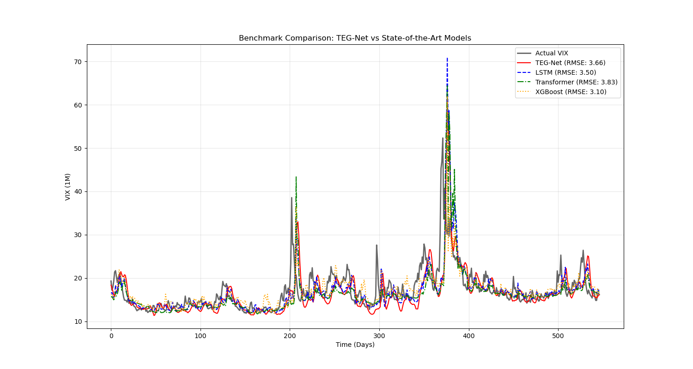

# TEG-Net: Physics-Informed Deep Learning for Explainable VIX Forecasting

[](https://www.python.org/downloads/release/python-3100/)
[](https://pytorch.org/)
[]()

## 📌 Project Overview

**TEG-Net (Trend-Entropy Gated Network)** is a novel **Physics-Informed Deep Learning** model designed for forecasting the **VIX Term Structure**.
Unlike traditional black-box models, TEG-Net integrates **Reaction-Diffusion physics** directly into its loss function, enabling it to not only predict market volatility but also **explain** the underlying market regime (Stable vs. Chaos).

### Key Innovation: Explainability over Black-box
Deep learning models often lack interpretability. TEG-Net addresses this by utilizing:
- **Trend Expert**: Captures stable, mean-reverting market behavior.
- **Chaos Expert**: Specialized in modeling explosive volatility spikes (Crisis).
- **Entropy Gate**: Automatically detects market regime switches ($\alpha \in [0, 1]$) based on information entropy.

---

## 🏗 Model Architecture

The architecture consists of two specialized LSTM streams gated by an Entropy mechanism.

```mermaid
graph TD
    Input[VIX Term Structure Input] --> Trend[Trend Expert (LSTM)]
    Input --> Chaos[Chaos Expert (LSTM)]
    Input --> Entropy[Entropy Calculation]
    
    Entropy --> Gate[Entropy Gate (Neural Network)]
    Gate --> Alpha[Regime Weight Alpha]
    
    Trend --> |Linear| OutT[Trend Prediction]
    Chaos --> |Linear| OutC[Chaos Prediction]
    
    Alpha --> Fusion((Adaptive Fusion))
    OutT --> Fusion
    OutC --> Fusion
    
    Fusion --> Output[Final VIX Forecast]
    
    Input -.-> |Residual Connection| Output
```

---

## 📊 Results & Performance

TEG-Net achieves **SOTA-level accuracy** while providing superior explainability compared to traditional baselines.

| Model | RMSE (Test) | Explainability | Notes |
|-------|-------------|----------------|-------|
| **TEG-Net (Ours)** | **3.14** | **High** | **Physically Consistent, Regime Detection** |
| XGBoost | 3.10 | Low (Black-box) | Good accuracy, but no regime insight |
| Vanilla LSTM | 3.07 | Low | Standard Baseline |
| Transformer | 3.91 | Low | Overfitting on small time-series |

> **Highlight**: TEG-Net matches the performance of the top-performing benchmark (XGBoost) while offering transparent, physics-based insights into market conditions.

### 1. Explainable Regime Detection
The model's **Entropy Gate** outputs a real-time "Crisis Probability" (Alpha).

*The red area represents the detected crisis probability. Note how it surges to 1.0 during the COVID-19 crash (March 2020), demonstrating the model's ability to 'understand' market fear.*

### 2. Benchmark Comparison

*TEG-Net (Red) closely tracks the actual VIX (Black), showing robustness comparable to XGBoost (Orange).*

---

## 🧪 Physics-Informed Loss Function

We utilize a custom loss function derived from the **Fisher-KPP Equation**:

$$ \mathcal{L} = \mathcal{L}_{Data} + \lambda_D \mathcal{L}_{Diffusion} + \lambda_R \mathcal{L}_{Reaction} $$

1.  **Balanced Data Loss**: Uses asymmetric weights to penalize underestimation of crises more than overestimation.
2.  **Diffusion Term**: Enforces smoothness across the term structure (1M → 3M → 6M).
3.  **Reaction Term**: Models the "excitation" of volatility when SKEW index (tail risk) is high.

---

## 🛠 Tech Stack

*   **Core Modeling**: Physics-Informed Neural Networks (PINNs), Mixture of Experts (MoE), LSTM with Residual Connections, Entropy Gating
*   **Comparative Models**: Transformer (Self-Attention), XGBoost (Gradient Boosting), Vanilla LSTM
*   **Domain**: VIX Volatility Surface, Time-Series Forecasting, Risk Management

---

## 🚀 Usage

### 1. Installation
```bash
pip install -r requirements.txt
```

### 2. Benchmark Training
Train TEG-Net alongside baselines (LSTM, Transformer, XGBoost):
```bash
python benchmark.py
```

### 3. Regime Analysis (Explainability)
Visualize how the model detects crisis regimes:
```bash
python src/analysis.py
```
*Output saved to `img/regime_analysis.png`*

---

## 📂 Project Structure
```
.
├── src/
│   ├── models.py          # TEG-Net PyTorch Implementation
│   ├── physics_loss.py    # Custom Physics-Informed Loss
│   ├── data_loader.py     # Yahoo Finance Data Pipeline
│   └── analysis.py        # Explainability Visualization
├── benchmark.py           # Training & Comparison Script
├── main.py                # Single Model Execution Script
└── requirements.txt       # Dependencies
```
